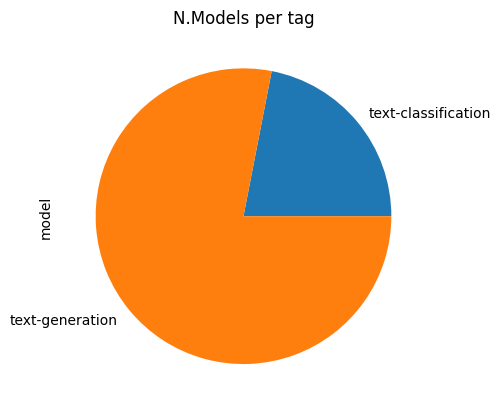
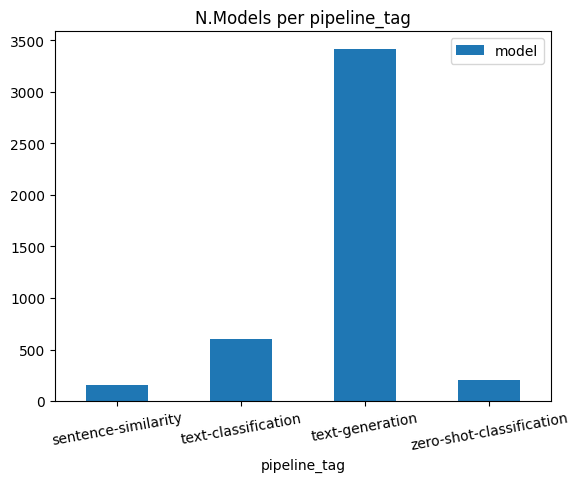

# ML-Dev-Ease-Classification-vs.-Generation
An Exploratory (Data) Analysis on Development Ease in ML Applications - Text Classification vs. Generation


## Table of Contents
- [Step 1 - Obtaining Popular Models](https://github.com/keivanipchihagh/ML-Dev-Ease-Classification-vs.-Generation#step-1---obtaining-popular-models)
- [Step 2 - Obtaining ML Spaces](https://github.com/keivanipchihagh/ML-Dev-Ease-Classification-vs.-Generation#step-2---obtaining-ml-spaces)


## Step 1 - Obtaining Popular Models
A simple scraper is developed under `src/scrapers/models.py` using [huggingface library](https://pypi.org/project/huggingface-hub/) since it requires less maintenance over time. This script is used to retrieve top 20 models for both *Text-Classification* and *Text-Generation* seperatly, then storing them under `data/models.csv`. Furthermore, the script supports arguments to customize the results. A usage example is provided below:

```python
python .\src\scrapers\models.py --sort likes --count 20
```

## Step 2 - Obtaining ML Spaces
Another scraper is developed under `src/scrapers/spaces.py` which performs two tasks. First, a list of all spaces is acquired under `data/spaces.csv` which contains roughly *175k* ML apps. Then, using parallelism, more details of each space is retrieved (i.e. models and datasets).

**Why parallelism?** [Back-of-the-envelope](https://en.wikipedia.org/wiki/Back-of-the-envelope_calculation) calculation shows that with a speed of 2 RPS (Request Per Second), it would take ~24 hours to fetch all 175k spaces! While utilizing 32 processes would be 16 times faster! (~1 hour)

> **Warning**
> Although it's very unlikely, parallelism could possibly result in DDOS attack, specially with higher process count, and thus should be used with caution.

### Step 2.5 - Comparing ML Apps Per Model
Among the *175690* apps on [huggingface](https://huggingface.co/), only *38982* of them have specified models (roughly 22%). Subsequently, *4375* of them have used our top 40 selected models for text-classification and text-generation (less than 12%).

Analyzing both `tag` and `pipeline_tag` have indicated that more text-genration usage is much higher.

