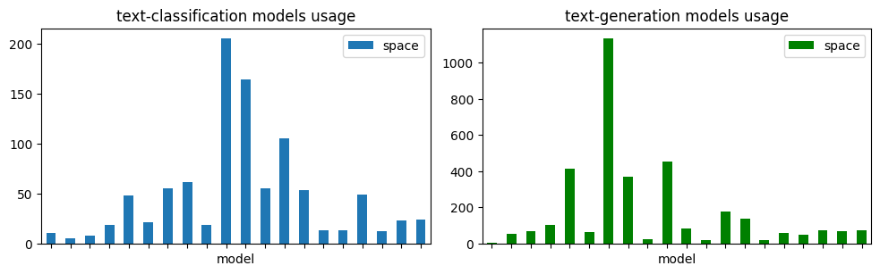
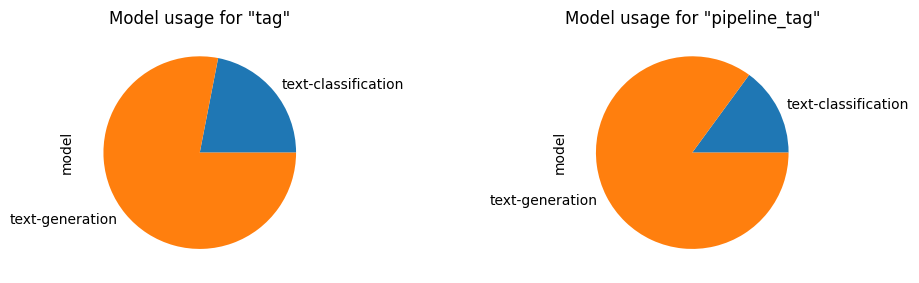
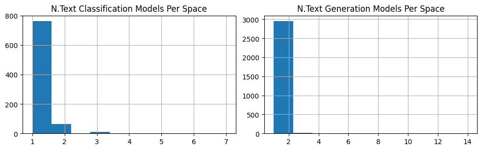

# ML-Dev-Ease-Classification-vs.-Generation
An Exploratory (Data) Analysis on Development Ease in ML Applications - Text Classification vs. Generation


## Table of Contents
- [Step 1 - Obtaining Popular Models](https://github.com/keivanipchihagh/ML-Dev-Ease-Classification-vs.-Generation#step-1---obtaining-popular-models)
- [Step 2 - Obtaining ML Spaces](https://github.com/keivanipchihagh/ML-Dev-Ease-Classification-vs.-Generation#step-2---obtaining-ml-spaces)
  - [Step 2.5 - Comparing ML Apps](https://github.com/keivanipchihagh/ML-Dev-Ease-Classification-vs.-Generation#step-25---comparing-ml-apps)
- [Step 3 - Obtain ML Codebase size](https://github.com/keivanipchihagh/ML-Dev-Ease-Classification-vs.-Generation#step-3---obtain-ml-codebase-size)
  - [Step 3.5 - Comparing ML Repositories](https://github.com/keivanipchihagh/ML-Dev-Ease-Classification-vs.-Generation#step-35---comparing-ml-repository)
- [Step 4 - Fruther analysis](https://github.com/keivanipchihagh/ML-Dev-Ease-Classification-vs.-Generation#step-4---fruther-analysis)
  - [Number of files / Lines of Code](https://github.com/keivanipchihagh/ML-Dev-Ease-Classification-vs.-Generation#number-of-files--lines-of-code)
  - [Dependencies Analysis](https://github.com/keivanipchihagh/ML-Dev-Ease-Classification-vs.-Generation#dependencies-analysis)
  - [Community Strength Analysis](https://github.com/keivanipchihagh/ML-Dev-Ease-Classification-vs.-Generation#community-strength-analysis)


## Step 1 - Obtaining Popular Models
A simple scraper is developed under [models.py](src/scrapers/models.py) using the [huggingface](https://pypi.org/project/huggingface-hub/) library. This script is used to retrieve the top 40 models for both *Text Classification* and *Text Generation* separately, then store them under [models.csv](data/models.csv). Furthermore, the script supports arguments to customize the results. A usage example is provided below:

```python
python .\src\scrapers\models.py --sort likes --count 20
```

## Step 2 - Obtaining ML Spaces
Another scraper is developed under [spaces.py](src/scrapers/spaces.py) which performs two tasks. First, acquires a list of all spaces under [spaces.csv](data/spaces.csv) which contains roughly *175k* ML apps. Then, more details of each space are retrieved under [spaces_extra.csv](data/spaces_extra.csv) (i.e. models). This was done using parallelism on 32 processes to accelerate the scraping.

**Why parallelism?** [Back-of-the-envelope](https://en.wikipedia.org/wiki/Back-of-the-envelope_calculation) calculation shows that with a throughput of 2 RPS (Request Per Second), it would take ~24 hours to fetch all 175k spaces, while utilizing 32 processes would take less than an hour. The number of processes could be increased further, but that could simulate a small DDOS attack. Although I believe this wouldn't generate much load for the API servers, I didn't increase them any more.

### Step 2.5 - Comparing ML Apps
Among the 175690 apps on [huggingface](https://huggingface.co/), only 38982 of them have specified models (roughly 22%), and thus are used in the analysis. Subsequently, our selected models have been used only 4375 times (~11%) distributed among 3737 spaces (2% of all spaces).

The following chart shows model usage in spaces per category. It's evident that "text generation" models are more widespread than "text classification":


Moreover, another chart shows usage of both "tag" and "pipeline_tag" for each category, which strengthens the assumption that more **"text-generation"** tags are used in general:


[Optional] Out of curiosity, plotting the distribution for the number of models used in spaces showed that several **"text-generation"** models are more commonly used together. This can indicate that it might be easier to maintain several of them at the same time:


In conclusion, by looking at both charts, it can be noted that **"text generation"** is a far more frequently used category than "text classification". However, I personally don't believe model usage is a good indicator of *"ease of use of software developer"*.

### Step 3 - Obtain ML Codebase size
For this purpose, a scraper was developed under [files.py](src/scrapers/files.py) that reads both *the number of files* and *the sum of all file sizes*. Subsequently, determining the size of each file doesn't require downloading it, but instead making a [HEAD](https://developer.mozilla.org/en-US/docs/Web/HTTP/Methods/HEAD) request to the files URL and analyzing *Content-Length* parameter would give us the filesize.

In more technical details, parallelism was also used in this step (with 64 processes, twice the number used in step 2) solely to speed up the scraping process. This was needed as repositories with hundreds or thousands of files would dramatically slow down the scraping if done on a single process. Moreover, some preprocessing was done to limit the scope to spaces that only have used our selected models from step 1, utilizing files [spaces_extra.csv](data/spaces_extra.csv) and [models.csv](data/models.csv). This was crucial as scraping all *175k* repositories would take forever, and not all the spaces are needed for our analysis.

### Step 3.5 - Comparing ML Repositories


## Step 4 - Further analysis
In this section, I went over a few more analyses that I believe are also helpful and can further shed light on the understanding of the matter.

### Number of files / Lines of Code
Analyzing the number of files would also contribute to the maintenance and development of the repository. This would make sense because having more files corresponds to more work that needs to be done. Furthermore, another useful parameter would be the number of lines of code which is more accurate than the number of files - especially when developers didn't distribute the code in multiple files - but is often more sophisticated as comments and irrelevant information should be omitted.

### Dependencies Analysis
From my own experience, some ML repositories are very difficult to use because of their old libraries and deprecated packages. This can be challenging because they often have OS compatibility issues or result in bugs that require parts of codes to be rewritten. I would suggest comparing the libraries in `requirements.txt` with the latest of their versions in [pypi](https://pypi.org/). This could outline very old packages that could be problematic.


### Community Strength Analysis
Another insightful feature would be the number of (unique) contributors or the frequency of their contribution to both "text classification" and "text generation" repositories. Having more active contributors means it is more highly for bugs to be fixed and questions to be answered over sites like [stackoverflow](https://stackoverflow.com/) or [github](https://github.com/).